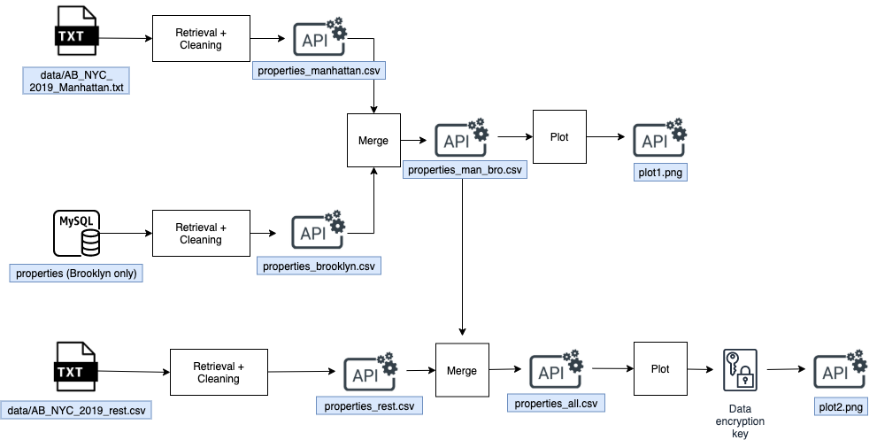

Airbnb demo
===========



This demo uses four components:
- simple-db-reader
- file-retriever
- http-data-merger
- python-plotter

First of all, we need to build and run the mysql database that the is used by the `simple-db-reader` component: 
Here is how to build the mysql image (all the commands must be run from the directory where this document is located):

```bash
docker build --target mysql-bnb -t mysql-bnb .
``` 

Let's run the database container:

```bash
docker run -d --rm --name mysql-bnb -p 3306:3306 -e MYSQL_ALLOW_EMPTY_PASSWORD=true mysql-bnb
```

Let's now build the image for the `simple-db-reader` in a way that it allows it to correctly communicate with the database:

```bash
docker build --target simple-db-reader --build-arg db_address=$(docker inspect -f '{{range .NetworkSettings.Networks}}{{.IPAddress}}{{end}}' mysql-bnb)  -t simple-db-reader .
```

To run the demo, we need to build the docker images for the remaining components.
Hereafter the commands to build the components:

```bash
docker build --target file_retriever -t file-retriever .
docker build --target http-data-merger -t http-data-merger .
docker build --target python-plotter -t python-plotter .
```


You can now head to the Streamesh UI and upload the four components:
- examples/simple-db-reader/simple-db-reader.yml
- examples/file-retriever/file-retriever.yml
- examples/http-data-merger/http-data-merger.yml
- examples/python-plotter/python-plotter.yml

Finally, upload the flow definition:
- examples/airbnb-flow.yml

From the services list, press `Run` on the flow item and provide the following inputs:
- manhattan-file -> AB_NYC_2019_Manhattan.txt
- others-file -> AB_NYC_2019_rest.txt

You can see a video of this demo running [here](https://www.youtube.com/watch?v=nlu9xmIURKU)
